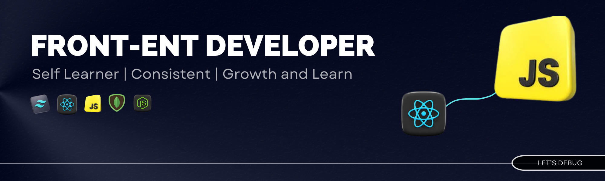

  

  <h1 align="center">Hi , I'm Jubayer </h1>

**A Frontend Focused Fullstack Developer**

## About Me

Hi! I'm a passionate **Frontend Developer** based in Bangladesh. I focus on creating clean, efficient, and user-friendly websites. My goal is to continuously improve my skills and stay updated with the latest industry trends, as I build innovative web applications that solve real-world problems.

### Currently Working On:

- Deepening my understanding of **React Query** for state management.
- Developing a personal blog website using **React** and **Tailwind CSS**.
- Exploring **Express.js** and **MongoDB** for backend development.
- Implementing advanced **JWT** for secure authentication in my applications.

🔭 I’m currently working on `a secret projects :-)`  
🌱 I’m currently learning 

 .  
👯 I’m looking to collaborate on MVP / Fun Projects and Localization (Bengali).  
🤔 I’m looking for help with Unlimited free mentorship :-) (JK)  
💬 Ask me about: Nothing (ask chatgpt)  
📫 How to reach me: Create an Issue in [this repository](https://github.com/jubayerahmed46/jubayerahmed46/issues/new)  
⚡ Fun fact: 2+2 = 4  

 
  
<h2>📊 Stats and Activity</h2>

  <h3>🔥 Streak Stats</h3>
  <!-- GitHub Readme Streak Stats - https://github.com/DenverCoder1/github-readme-streak-stats -->
  

    <a href="https://github.com/jubayerahmed46/">
      <!-- Use https://streak-stats.demolab.com or self-host with your own Vercel app - visit https://git.io/streak-stats for instructions -->
      
    </a>
<!--     
🔥 Get streak stats for your profile at <a href="https://git.io/streak-stats">git.io/streak-stats</a>
 -->

  <h3>💻 GitHub Profile Stats</h3>
  <!-- https://github.com/anuraghazra/github-readme-stats -->
  
  
   

  <!-- <b>Note:</b> Top languages is only a metric of the languages my public code consists of and doesn't reflect experience or skill level. -->
  <!-- https://github.com/ashutosh00710/github-readme-activity-graph -->

<!-- github default
### Hi there 👋
**jubayerahmed46/jubayerahmed46** is a ✨ _special_ ✨ repository because its `README.md` (this file) appears on your GitHub profile.

Here are some ideas to get you started:

- 🔭 I’m currently working on ...
- 🌱 I’m currently learning ...
- 👯 I’m looking to collaborate on ...
- 🤔 I’m looking for help with ...
- 💬 Ask me about ...
- 📫 How to reach me: ...
- 😄 Pronouns: ...
- ⚡ Fun fact: ...
-->

